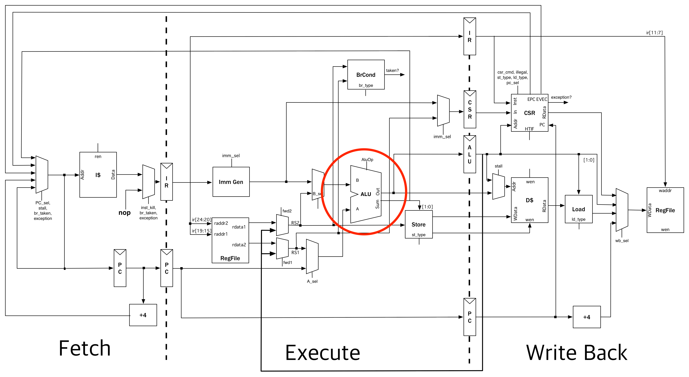

# riscv-mini Lab

In this lab, you will be working on a 3-stage, pipilined risc-v processor. One of the modules on risc-v data path is not complete. You need to find that module and fix the problem. The following diagram shows which module has been modified:

## Getting Started

Before starting, you need to make sure the following commands are executed:

    $ git clone https://github.com/ucb-bar/riscv-mini.git
    $ cd riscv-mini
    $ git submodule update --init
    $ make publish    # you need to local-publish firrtl due to sbt's limitation
    $ make            # this will give you the firrtl & verilog output files in generated-src
    

    
## Tests

After you ran the commands above, you can run unit tests to make sure your fix is valid. `riscv-mini` provides *theoretically* synthesizable unit & integration tests. Theres are six sets of unit tests(`ALUTests`, `BrCondTests`, `ImmGenTests`, `CSRTests`, `CacheTests`, `DatapathTests`),
running user-defined test vectors.
To execute them, first launch `sbt` and run:

    > testOnly mini.[testname]
  
There are also six sets of integration tests, running the hex files from [riscv-tests](https://github.com/riscv/riscv-tests).
To execute them, also launch `sbt` and run:

    > testOnly mini.[Core|Tile][Simple|ISA|Bmark]Tests
    
`Core` only contains the datapath and the control unit, while `Tile` also contains I$ and D$. `Simple` only runs `rv32ui-p-simple`,
`ISA` runs the whole ISA tests, and `Bmark` runs five benchmarks(`median`, `multiply`, `qsort`, `towers`, `vvadd`). 
Note that all tests in a set run in parallel.

Finally, to run all the tests, just in sbt:

    > test

## Soloutions

You can find souloutions to this lab in the following link:

    https://github.com/ucb-bar/riscv-mini